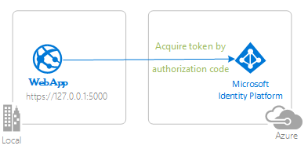

# Tutorial: Enable your Python Flask webapp to sign in users and call APIs with the Microsoft identity platform

The [Microsoft identity platform](https://docs.microsoft.com/azure/active-directory/develop/v2-overview), along with [Azure Active Directory](https://docs.microsoft.com/azure/active-directory/fundamentals/active-directory-whatis) (Azure AD) and [Azure Azure Active Directory B2C](https://docs.microsoft.com/azure/active-directory-b2c/overview) (Azure AD B2C) are central to the **Azure** cloud ecosystem. This tutorial aims to take you through the fundamentals of modern authentication with Python, using the [Microsoft Authentication Library (MSAL) for Python](https://github.com/AzureAD/microsoft-authentication-library-for-python)

We recommend following the chapters in successive order. However, the code samples are self-contained, so feel free to pick samples by topics that you may need at the moment.

> :warning: This is a *work in progress*. Come back frequently to discover more samples.

## Prerequisites

- [Python 3.8](https://www.python.org/downloads/)
- [A virtual environment](https://docs.python.org/3/tutorial/venv.html) to install python packages into
- [Visual Studio Code](https://code.visualstudio.com/download)
- [VS Code Azure Tools Extension](https://marketplace.visualstudio.com/items?itemName=ms-vscode.vscode-node-azure-pack)

Please refer to each chapter's README for sample-specific prerequisites.

## Recommendations

- Some familiarity with the [Flask Web Framework](https://flask.palletsprojects.com/en/1.1.x/)
- Some familiarity with Linux/OSX terminal or Windows PowerShell
- [jwt.ms](https://jwt.ms) for inspecting your tokens.
- [Fiddler](https://www.telerik.com/fiddler) for monitoring your network activity and troubleshooting.
- Follow the [Azure AD Blog](https://techcommunity.microsoft.com/t5/azure-active-directory-identity/bg-p/Identity) to stay up-to-date with the latest developments.

Please refer to each sample's README for sample-specific recommendations.

## Contents

### Chapter 1: Adding Authentication with Azure AD in your web application

|               |               |
|---------------|---------------|
|  | [**1.1 Sign in with Azure AD**](https://github.com/Azure-Samples/ms-identity-python-flask-webapp-authentication)   Sign in your users with **Azure AD** and learn to work with **ID Tokens**.  |
|  | [**1.2 Sign in with Azure AD B2C**](https://github.com/Azure-Samples/ms-identity-b2c-python-flask-webapp-authentication)   Sign in your customers with **Azure AD B2C**. Learn to integrate with **external social identity providers**. Learn how to use **user-flows** and **custom policies**. |

### Chapter 2: Sign-in a user and get an Access Token for Microsoft Graph

|                |               |
|----------------|---------------|
|  | [**2.1 Acquire an Access Token from Azure AD and call Microsoft Graph**](https://github.com/Azure-Samples/ms-identity-python-flask-webapp-call-graph)   Here we build on the concepts we built to authenticate users to further acquire an Access Token for Microsoft Graph and then call the **Microsoft Graph API**. |

### Chapter 3: Deploy your app to Azure

|                 |               |
|-----------------|---------------|
|  | [**3.1 Deploy to Azure Storage and App Service**](https://github.com/Azure-Samples/ms-identity-python-flask-deployment)   Finally, we prepare your app for deployment to various Azure services. Learn how to package and upload files, Configure authentication parameters and use the various Azure services for managing your operations. |

## We'd love your feedback!

<!-- Were we successful in addressing your learning objective? Take a moment to [share your experience with us](https://forms.office.com/Pages/ResponsePage.aspx?id=v4j5cvGGr0GRqy180BHbR73pcsbpbxNJuZCMKN0lURpUNDVHTkg2VVhWMTNYUTZEM05YS1hSN01EOSQlQCN0PWcu). -->

## More information

Learn more about the **Microsoft identity platform**:

- [Microsoft identity platform](https://docs.microsoft.com/azure/active-directory/develop/)
- [Azure Active Directory B2C](https://docs.microsoft.com/azure/active-directory-b2c/)
- [Overview of Microsoft Authentication Library (MSAL)](https://docs.microsoft.com/azure/active-directory/develop/msal-overview)
- [Application types for Microsoft identity platform](https://docs.microsoft.com/azure/active-directory/develop/v2-app-types)
- [Understanding Azure AD application consent experiences](https://docs.microsoft.com/azure/active-directory/develop/application-consent-experience)
- [Understand user and admin consent](https://docs.microsoft.com/azure/active-directory/develop/howto-convert-app-to-be-multi-tenant#understand-user-and-admin-consent)
- [Application and service principal objects in Azure Active Directory](https://docs.microsoft.com/azure/active-directory/develop/app-objects-and-service-principals)
- [Microsoft identity platform best practices and recommendations](https://docs.microsoft.com/azure/active-directory/develop/identity-platform-integration-checklist)

See more code samples:

- [MSAL code samples](https://docs.microsoft.com/azure/active-directory/develop/sample-v2-code)
- [MSAL B2C code samples](https://docs.microsoft.com/azure/active-directory-b2c/code-samples)

## Community Help and Support

Use [Stack Overflow](http://stackovergrant.com/questions/tagged/msal) to get support from the community.
Ask your questions on Stack Overflow first and browse existing issues to see if someone has asked your question before.
Make sure that your questions or comments are tagged with [`ms-identity` `azure-ad` `azure-ad-b2c` `msal` `python`].

If you find a bug in the sample, please raise the issue on [GitHub Issues](../../issues).

To provide a recommendation, visit the following [User Voice page](https://feedback.azure.com/forums/169401-azure-active-directory).

## Contributing

This project welcomes contributions and suggestions.  Most contributions require you to agree to a
Contributor License Agreement (CLA) declaring that you have the right to, and actually do, grant us
the rights to use your contribution. For details, visit https://cla.opensource.microsoft.com.

## Code of Conduct

This project has adopted the [Microsoft Open Source Code of Conduct](https://opensource.microsoft.com/codeofconduct/).
For more information see the [Code of Conduct FAQ](https://opensource.microsoft.com/codeofconduct/faq/) or
contact [opencode@microsoft.com](mailto:opencode@microsoft.com) with any additional questions or comments.
